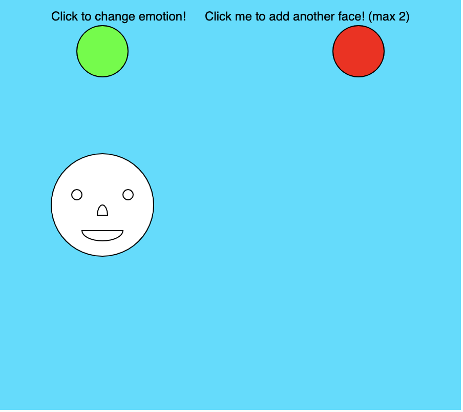
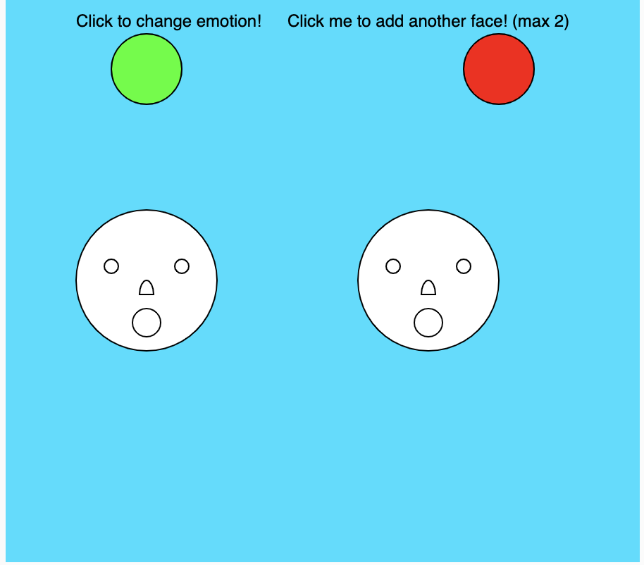

I made a program that allows you to change the emotion on a face upon a mouse click of a button. 

You also have the option to add another face with a button click which I could do using object oriented programming. I simply created 2 objects at the start of the program into an array. To draw the faces, the program iterates of the arrays. In order to change the number of faces it draws, I adjusted how much of the array the for loop would iterate by using a global variable.

The face has 3 options to change into. I made use of the modulus function to make it go in a loop. Here's the part of the code:

```
choice = (choice + 1) % 3; //keeps choice between 0 and 2 (inclusive)
```    

Here's the output of the program:



I've also uploaded a video to show how the program works. This was a fun project to complete to emphasize the use of object oriented programming.
