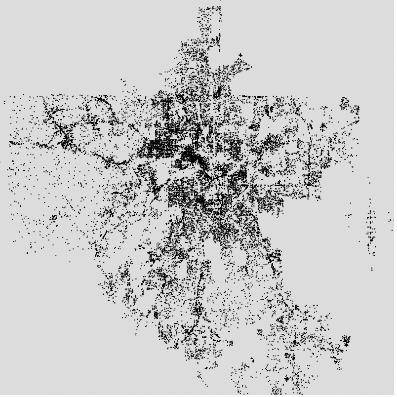

# Idea
<ul>
  <li>I found a dataset of the crimes in Atlanta on Kaggle. Click [here](https://www.kaggle.com/omarhossam214/atlantacrimedata?select=atlcrime.csv) to find the dataset.</li>
  <li>In this dataset, there were 2 fields that were of interest: longitude and latitude values.</li>
  <li>I wanted to use these values to plot a point on the locations where a crime had taken place </li>
  <li>The final output should resemble the map of Atlanta.</li>
  <li>Using this visualization, you should be able to see where the most crimes take place by looking at how dark the region is. This makes sense because more points would be plotted in the region. </li>
</ul>

# Process
<ol>
  <li>I downloaded the dataset from Kaggle.</li>
  <li>When I tried uploading this csv file on p5js, an error was thrown: the file was too big</li>
  <li>The original dataset had around 270,000 records. I edited the spreadsheet so it only included 40,000 records. This allowed me to update the file on p5js </li>
  <li>After loading the dataset in the program, I had to find the minimum and maximum values of latitude and longitude in order to map it into the canvas size. </li>
  <li>Instead of having 4 different variable names, I used 2 arrays to represent the range of latitudes and longitudes. The first value represented the minimum and the second value represents te maximum value. </li>
  
  ```
  
let latRange = []; //this array will save min and max latitude 

let longRange = []; //this array will save min and max longitude
  ```
  
  <li>After finding the min and max values, I mapped the values to the canvas. </li>
  
  ```
let xpos = map(longitudes[i], longRange[0], longRange[1], 0,width);

let ypos = map(latitudes[i], latRange[0], latRange[1], 0,height);
  ```
  
  <li>Finally, I plotted the points and the output was just as expected, an image similar to the map of Atlanta. This was surpirsing because I only used 40,000 records instead of the entire data. I would love to see how the output would change if I could use the entire dataset for the visualization.</li>
  
  <li> We can also see that more crime was taking place in the center of the map because the points are more densely packed together.</li>

</ol>

# Output

    
