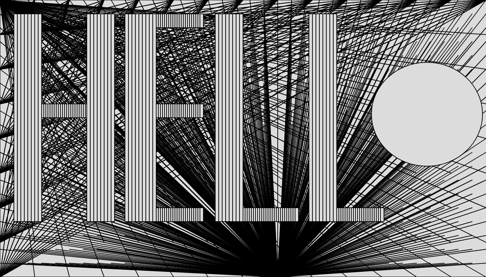

-I used functions and for loops to make this. The nested for loops work well to give an abstract look to the lines I have in the background - it did take me a bit to figure out exactly how it was working though.
-Found myself reusing the same code with different numbers to draw rectangles for different letters. Came up with functions in order to re-use the code.

```
function setup() {
  createCanvas(700, 400);
}

function draw() {
  background(220);

  //lines in background
  for(let x =0; x<=700; x+=50){
    for(let y = 0; y<=400; y+=50){
      line(x,y,0,0)
      line(0,y,x,0)
      line(x,0,0,y)
    }
  }
  
  for(let x = 700; x>=0; x-=20){
    for(let y = 400; y>=0; y-=20){
      line(400,400,x,y)
    }
  }
  
  //H
    //first vertical line
  Vertical(20,60)
    //the bridge
  Horizontal(60,125,150)
    //the end
  Vertical(125,165)
  
  //E
    //vertical
  Vertical(180,225)

    //first bar
  Horizontal(225,290,150)

    //second bar
  Horizontal(225,290,20)

    //third bar
  Horizontal(225,290,300)

  //L
    //Line
  Vertical(310,350)
  
    //floor
  Horizontal(350,425,300)
  
  //L
    //line
  Vertical(445,485)
  
    //floor
  Horizontal(485,550,300)
  
  //O
  fill(220)
  ellipse(615,165,160,150)
  
  print(mouseX, mouseY)
  
  
}

function Vertical(a,b){
  for(let x = a; x<b; x+=5){
    rect(x,20,5,300)
  }
}

function Horizontal(a,b,c){
  for(let x = a; x<=b;x+=3){
    rect(x,c,5,20)
  }
}
```


