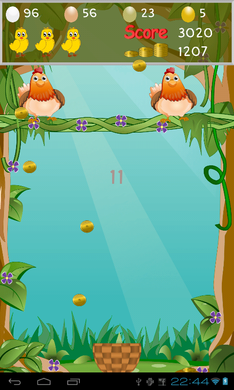

# EGG CATCH

##Initial Concep
I will try to recreate the egg catch game that was famous during the early 2000. It was a classical arcade game, here's an image:

The objective of the game is to control a basket with your mouse to catch eggs that the chickens drop. You lose a life whenever an egg is missed and the game is over when the user runs out of lives. The score corresponds to the number of eggs that the user has caught.

I will also be adding some of my own modifications to make the game more personal to me:
<ul>
  <li>Instead of just eggs dropping, there will be "bad" objects like rotten eggs and bombs that the user must avoid.</li>
  <li>Audio effects for each kind of object caught. If it is a bomb, a sound effect of an explosion will be played.</li>
  <li>The ability to change difficulty from the main menu of the game. The harder the difficulty, the faster the objects will fall down.</li>
</ul>

## Complicated/Unknown Part
Making the objects fall from random chickens at random times will prove to be hard. 

## Solving the problem
I wrote a small program to test if the eggs would appear from random chickens and fall down as well. I solved it by doing:
<ul>
  <li>Add the chickens to an array </li>
  <li>When adding the eggs, chose a random index from 0 to the number of chickens minus 1. This is because if there are 2 chickens, the indexes are 0 and 1 for 1 and 2 respectively.</li>
  <li>With the index, get the X coordinate of the specific hen and then make adjustments so that the x value is at the middle of the chicken.</li>
  <li>I used object oriented programming for everything so that I would not need to write the same code again and for ease of use </li>
  <li>Note that in the test program, I did not include images as I only wanted to test my understanding of the solution I had in mind. I will be adding these later. </li>
</ul>
